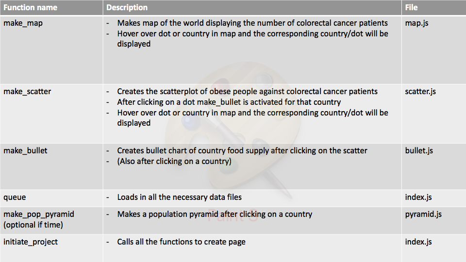

# DESIGN DOCUMENT:

Sylvie Langhout - 10792368

Programmeerproject Minor Programmeren

06/06/2018

# Data sources:

 [OECD](http://stats.oecd.org/#)
 - Colorectal cancer statistics, incidence per 100.000 citizens per country for the years 2000, 2002, 2008, 2012. This can be displayed in the world map, showing the difference for the countries and where the colorectal cancer prevalence is highest. Slider to change the years.
 - Obesity statistics, % of the population. This can be displayed against the colorectal cancer incidence, showing if people who eat bad (obese) in a country also have more people with colorectal cancer. Then you can click on a country and display what the food supply in that country is like and what people eat. 
 - Food supply, the sugar supply, fat supply, protein supply, vegetable supply and fruit supply for the countries. From this I can calculate what the average countries' supply is and set this in the bullet chart to compare the different countries to eachother. This can also be displayed by searching for a country in a Search bar.
 - Colorectal cancer mortality, number of deaths female, male and both for the years 2000 - 2015. This can then be displayed in a population pyramid seeing the change over the years. Slider to side through the countries. This is optional and extra if time. 
 - Dropdown menu to select a year for your data the bullet chart

 CSV files, converted to JSON by convertCSV2JSON.py, file made in dataprocessing. All data files can be found in the folder data. I will extract the necessary data from these files, the necessary data is described above. 

# Technical Components

# Functions:

- D3 Geomap to make Map
- D3 Bar to make barchart
- D3 plus to make scatterplot
- D3 Funnel to make population pyramid
- D3 
- D3 Tooltip to create tooltips
- D3 slider 

