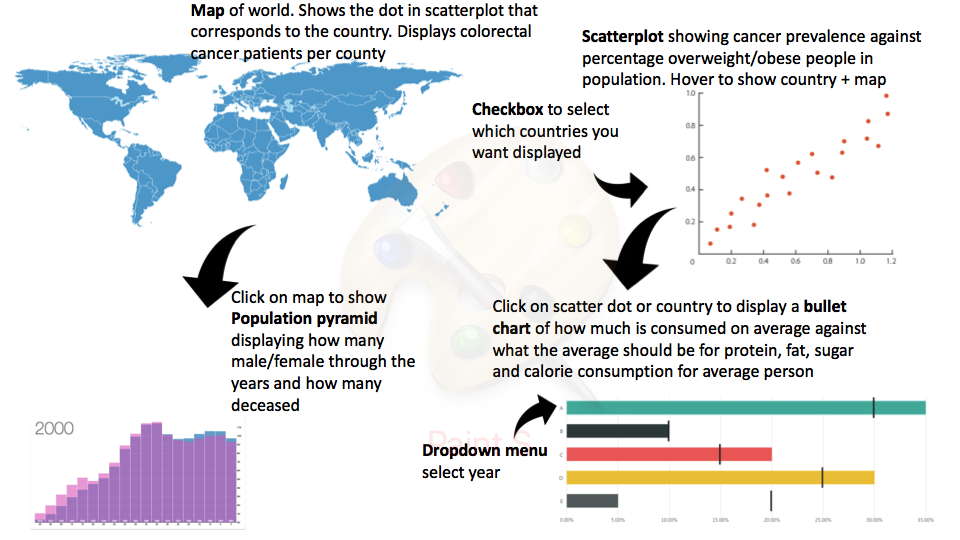

# Programmeerproject

Sylvie Langhout
10792368

[My Project](https://slanghout.github.io/Programmeerproject/)

## My idea
This datavisualisation will display colorectal cancer frequence against fat, protein and sugar food consumption. This can show what type of food consuption may lead to a higher chance of colorectal cancer. 

## Features:
- A map with a hover over function to display the prevalence of colorectal cancer in different countries, year can be changed by a dropdown menu
- When clicking on this map, a bar chart will show with the prevalence male/female ratio
- A scatterplot with the protein/fat/calories/sugar/fruit/vegetables intake, with a checkbox to click what to show, against the colorectal cancer prevalence per county
- When clicking on a dot, a bullet chart will show what the people eat against what should be eaten and if what they eat is in line with needed/average

- MVP: scatterplot, map, bullet graph, checkbox and dropdown menu

## Prerequisites
Data sources:
- http://stats.oecd.org/# 
	
	cancer prevalence

	food consuption database

Libraries:
- D3

The hardest part will be to nicely display everything without it being too full. Maybe not display everything at once/ make some graphs appear and disappear. 

## Final

