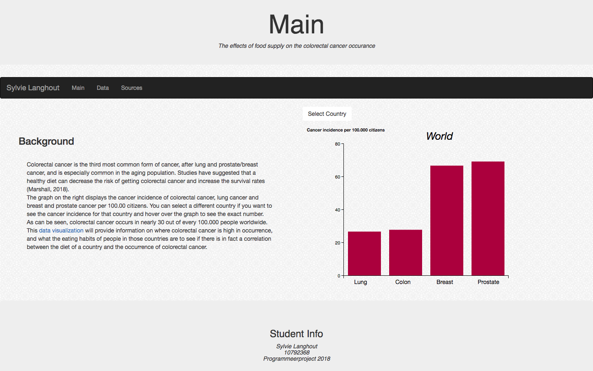
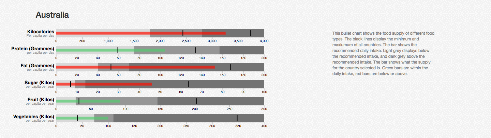
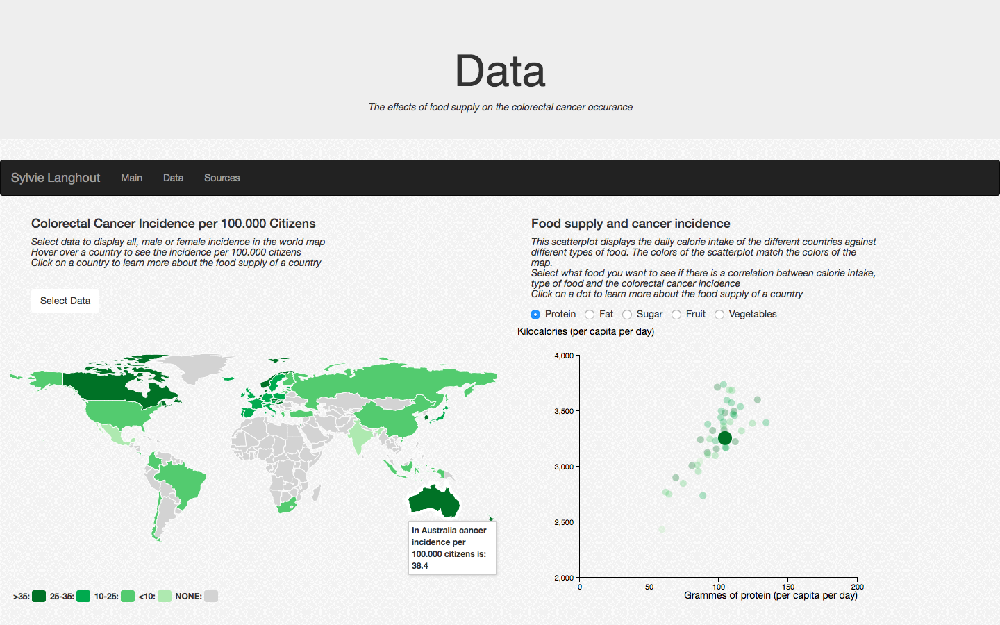

# Programmeerproject

[My Website](https://slanghout.github.io/Programmeerproject/)
[Product Demo](https://youtu.be/M0WUEInkN_g)

## Eating habbits and Colorectal cancer occurance

A bad diet is believed to increae the risk of getting colorectal cancer. My data visualisation provides insight in the incidence of colorectal cancer in different countries, and the eating habbits of those countries. By comparing this data, the user gains a full overview of what countries eat and how many people have colorectal cancer in that country and thereby see if countries that eat more or less of the daily recommended intake of a specific type of food have a bigger or smaller risk of getting colorectal cancer.

After entering the site you come to my main page. Here the problem is explained and displayed using a bar chart that shows cancer incidence for the top 3 most occuring types of cancer; Lung, colorectal and breast/prostate. The user can select a country they want the data from using a dropdown menu, the default is world.

Then, the user can go to the data page to see more about food and colorectal cancer data and to see if a link can be seen. First, a map displating colorectal cancer incidence together with a scatterplot of the calories they eat in all countries on the y-axis with on the x-axis a type of food the user can select. The color of the dots matches the colors of the map and the colorectal cancer incidence. This way the user can see if there is a correlation between the amount people eat in a country, a food type they can select and the occurance of colorectal cancer. Hovering over a country will increase the size this dot to make it easier to spot a specific country on the scatterplot. Hovering over the scatterplot will show the exact amounts. The user can choose the data for colorectal cancer incidende, default is all and both male and female can be chosen. Food type default is protein and fat, sugar, fruit and vegetables can be chosen. 

After clicking on a country or a dot in the scatterplot, a bullet chart appears with additive data on this country. The user can see if the people in that country eat according to the daily recommended intake for each food type. If the lines in the bar are red they either eat too much or too little, and green means they eat a right amount.

## Copyright
De algemene voorwaarden voor gebruik, reproductie en distributie van de code zijn te vinden in LICENSE. Verder gebruik van overige libraries die in bezig zijn van derden:

- D3. Released under the BSD 3-Clause "New" or "Revised" License and is Copyright (2010-2017) Mike Bostock.
- Bootstrap. Released under the MIT license and is Copyright (2016) Twitter and Copyright (2011-2018) Bootstrap Authors.
- Jquery. Released under the MIT license.
- D3 Worldmaps, Copyright (2012) Mark DiMarco. Released under the MIT License.
- Topojson. Copyright (c) 2012-2016, Michael Bostock
- Bullet. Released under the GNU General Public License, version 3 and Copyright (2018) Mike Bostock.
- [Background](https://www.toptal.com/designers/subtlepatterns/)

Sylvie Langhout
10792368
