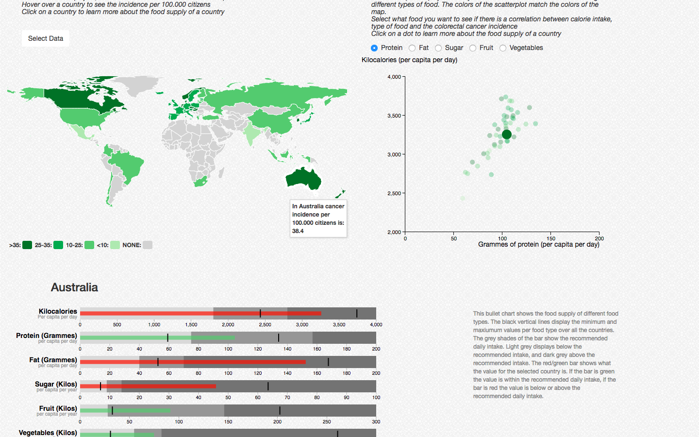

# Report Programmeerproject 2018
*Sylvie Langhout
10792368
28/06/2018*

## Description of the Application

My data visualisations shows the possible correlation between eating habbits and colorectal cancer incidence of different countries. The map shows cancer incidence in different countries (entire population, male population or female population), the scatterplot shows calories versus a chosen food type (protein, fat, sugar, fruit or vegetables). Clicking on a country or a dot will show a bullet chart of the chosen country with additive information about their eating habbits. 

## Technical Design

I have three different HTML codes for different pages of my website:
- index.html *my home page*
- data.html *page with my data visualisation*
- sources.html *page with the sources I used*

My code consists of:
- script_index.js *to load the data for the home page*
- barchart.js to *make and update the barchart on the home page*
- script_data.js *to load the data for the data page*
- map.js to make *and update the world map on the data page*
- scatter.js to *make and update the scatterplot on the data page*
- bullet.js to *make and update the bullet chart on the data page*

The design of the page is done using 3 CSS files:
- project.css *to design all three html files*
- index.css *to design the home page*
- data.css *to design the data page*

I started by converting my CSV files to JSON files. I then selected the data for the year 2012, because I had most data for this specific year, and filtered the data to show only the countries that overlap in all my datasets to create the fullest overview possible. The data is first loaded in **script_index.js** for the home page. Here a barchart displaying colorectal cancer incidence compared to lung and breast/prostate cancer is shown. I have done this to display the problem there is since colorectal cancer is very frequently occuring and this can be seen by comparing it to other types of cancer where people more often hear from like lung and breast. I filtered the data per country and calculated the mean values for the world population for the default. The barchart is made in **barchart.js** in *makeBarchart*. The user can select a different country to visualise the incidence for the cancer incidence of different countries. The data for the specific country will be selected using the functon *bardata* and the height of the bars and y-axis will then change to match the values of that country in an update function *updateBarchart*. Hovering over the barchart will show the total values.

Next, the user can go the data page to learn more about eating habbits and colorectal cancer incidence in different countries. The data is loaded in via **script_data.js**. First a map displaying the colorectal cancer incidence per 100.000 citizens is shown, this map is made by *makeMap* and updated by *updateMap* in **map.js**. The default color is green which shows the incidence of the entire population of the countries, and with a dropdown menu the user can either select only the male population, turning the colors blue, or the female population, turning the colors red. This is done by the *createColorMap* function. This is done to see a possible difference between male and female colorectal cancer incidence in different countries which can be rather big. This is done by selecting the fill of the map depending on the user input and making the map by making a dictionary of the colorscheme. The map updates by removing a prior map and making a new map with a new colorscheme. The *showDot* function will display the exact cancer incidence of that country and the dot belongs to that country in the scatterplot after hovering over a country.

Next to the map a scatterplot is made by **scatter.js**, with the data also loaded in **script_data.js**. The data is first divided into the different food types and then combined in an array of different arrays to easily select the data. The data is selected by *scatterData* function. The y-axis of the scatterplot shows the daily calorie intake for the countries and the x-axis is made up of different food types these calories can be made up from, either protein, fat, sugar, fruit of vegetables. *makeScatter* creates the initial scatterplot with default protein. The user can select what they want displayed on the x-axis via checkboxes on top of the scatterplot. With an update function *updateScatter* the data for a different food type is selected and the scatterplot x values can change. The colors in the scatterplot correspond to the colors of the map and change when the user selects different data for the map via the dropdown menu and are selected using *createColorscheme*. I did this to see if there is a correlation between the amount of calories, a food type and the incidence of colorectal cancer. 

Clicking on a country or a dot in the scatterplot will scroll the page down where a bullet chart with additional information about the eating habbits of the selected country are shown. The data used here is the same data as that of the scatterplot, and made into a dictionary in *bulletData*, together with the recommended daily intake for the food types. The bullet chart is made in **bullet.js** The first bullet chart is made in *makeBullet* and will show the value for the selected country in the middle bar. The grey shades show the recommended intake, light grey being below, medium being within and dark grey being above. The vertical black lines show the minimum and maximum values of the entire dataset. The value bar is either red, if the value is below or above the recommended daily intake, and green if it is within. This is done in the *colorBullet* function. I did this to make it easy for the user to see if the eating habbits of the country are within the daily recommended intake for the different countries. This graph can thus show additional information on the eating habbits of a specific country. If a country is high in colorectal cancer, the chart can show what the eating habbits are, and what they are compared to the recommended intake. After clicking a second time on a dot or a country, the bullet chart will update using *updateBullet*. The code always checks if the bullet chart is already made, therefore not having to remove and remake it if it is already made.

## Challenges and Arguments

In my origional proposal I wanted to change the year value. I later decided against this because for 2012 I had most data and thus the biggest overview. The promblem also is not one that changes much between the different years and therefore a year with the most complete overview was more valuable than multiple years. However, the male/female difference between countries was significant for some countries, and therefore very interesting. I initially wanted to show this in a seperate population pyramid but did not feel like this would add much to the visualisation and it could be much easier shown in the map, preventing an overkill of graphs on the site.

I changed the scatterplot layout, where I first wanted to show the cancer and obesity correlation in the scatterplot, I changed it to the eating patterns against the cancer incidence. The obesity correlation seemed like an additional extra and again an overkill of information without showing much additional information to the user. Therefore, I decided to change the scatterplot layout after discussing this. The map and scatterplot would this way give a good overview already of the eating habbits and cancer incidence of a country, and the bullet chart could then give additional information for a specific country if the user would want to see this. 

The barchart on the home page was an addition extra barchart, this to further explain the problem that colorectal cancer is by comparing it to other types of cancer to clearly visualise this to the user and not just describe it using numbers, but show these numbers to the user. By being able to select different countries here, the user can also see that these numbers are not the same for every country and that therefore something like eating habbits might be the cause of this. 

The bullet chart would origionally only show the average for all countries against the recomended intake, but I felt like the value per country would be much better to gain more information about the country selected. Therefore, I changed the idea for the bullet chart to show data per country instead of one for all countries.

If I had had more time, I would have liked to have added more different food types to maybe see if a diet with high or low intake of meat or nuts for instance have an effect. However, I felt like with limited time to better impelement the data I had rather than find more and have a site that works less good.